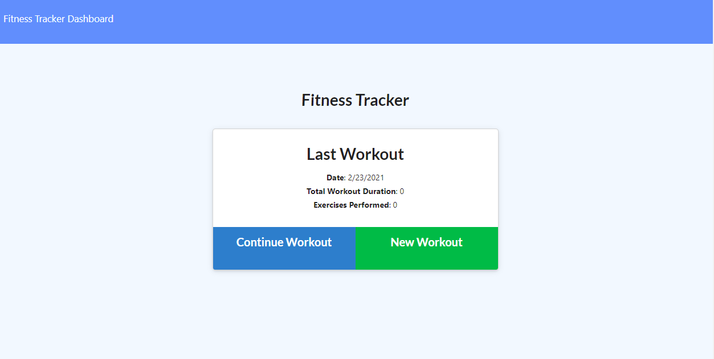

# Fitness Tracker  
    
    
MIT
Copyright (c) [2020] [Austyn Whaley]

---

### Table of Contents

- [Description](#description)
- [Installation](#installation)
- [Usage](#usage)
- [Testing](#Testing)
- [Contribution](#Contribution)
- [Questions](#Questions)
    

---

## Description

### This application will track your workouts and save them into a database and will also save new workouts

---

## Installation

### To install this program you will need to run

#### npm install

---

## Usage

### Usage for this application:

#### To track fitness progress

---

## Testing

### How to test application:

#### npm test

---

## Contribution

### The guidelines for contributon to this application are as follows:

#### there are no contributions

---

## Questions

Any questions regarding the application can be answered at:

[Link to Github](https://github.com/austynwhaley/)
##### Email: austyn_whaley@yahoo.com
    
